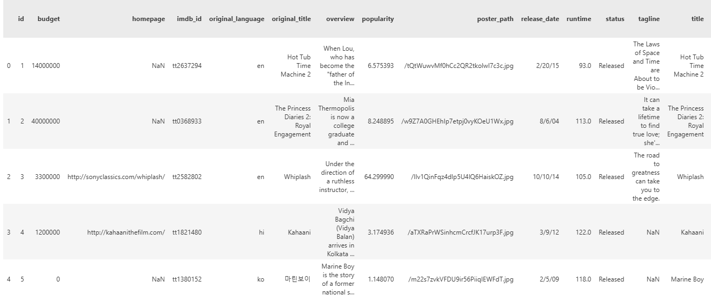
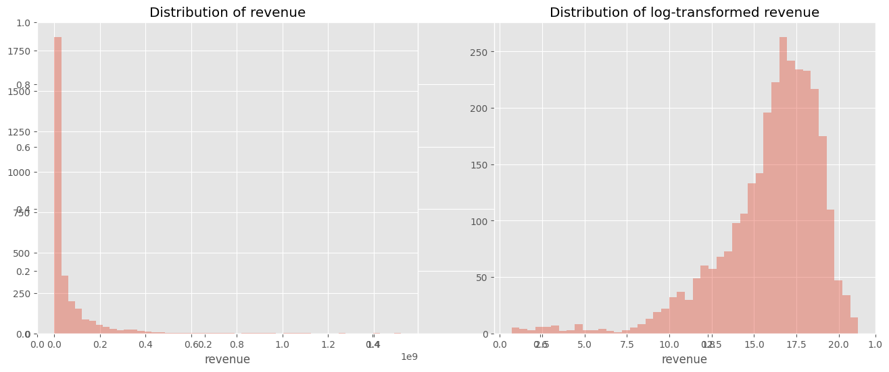
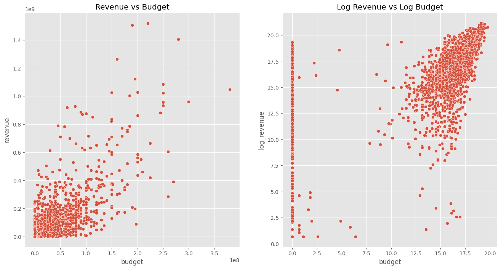
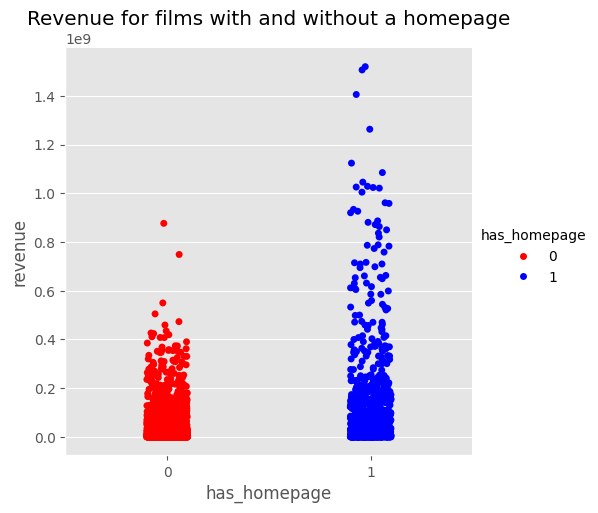
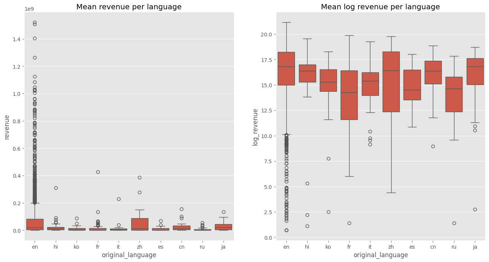

# Analisis Data Box Office Global dengan Python

## Daftar Isi

1.  [Pendahuluan Proyek](#1-pendahuluan-proyek)
2.  [Studi Kasus & Tujuan](#2-studi-kasus--tujuan)
3.  [Dataset](#3-dataset)
4.  [Tahapan Analisis & Temuan Utama](#4-tahapan-analisis--temuan-utama)
    * [Penanganan dan Eksplorasi Data](#penanganan-dan-eksplorasi-data)
    * [Distribusi Variabel Target](#distribusi-variabel-target)
    * [Hubungan Pendapatan Film dan Anggaran](#hubungan-pendapatan-film-dan-anggaran)
    * [Pengaruh Homepage Terhadap Pendapatan](#pengaruh-homepage-terhadap-pendapatan)
    * [Distribusi Bahasa dalam Film](#distribusi-bahasa-dalam-film)
    * [Kata-kata Kunci dalam Judul dan Deskripsi](#kata-kata-kunci-dalam-judul-dan-deskripsi)
    * [Pengaruh Deskripsi Film Terhadap Pendapatan](#pengaruh-deskripsi-film-terhadap-pendapatan)
5.  [Rekomendasi](#5-rekomendasi)
6.  [Kontak](#6-kontak)

---

## 1. Pendahuluan Proyek

Proyek ini adalah analisis data eksploratori (EDA) yang komprehensif terhadap data box office film global. Sebagai seorang Data Analyst, tujuan utama proyek ini adalah menggali wawasan berharga mengenai faktor-faktor yang mempengaruhi pendapatan film, yang pada akhirnya akan menjadi dasar bagi pengambilan keputusan strategis dalam industri film.

## 2. Studi Kasus & Tujuan

Dataset yang digunakan dalam proyek ini berisi data film dan informasi terkait seperti anggaran, pendapatan, bahasa, homepage, dan deskripsi film. Data ini diambil dari [The Movie Database (TMDb)](https://www.themoviedb.org/), sebuah platform sumber terbuka yang menyediakan data film dari berbagai negara dan tahun rilis.

Melalui eksplorasi data (*Exploratory Data Analysis* / EDA), proyek ini bertujuan untuk:

- Memahami distribusi pendapatan film dan anggaran produksinya.
- Mengidentifikasi hubungan antara anggaran produksi dengan pendapatan yang dihasilkan.
- Menganalisis dampak keberadaan homepage resmi film terhadap pendapatan.
- Melihat bagaimana bahasa asli film (original language) berkorelasi dengan performa pendapatan.
- Mengekstrak kata kunci umum dari judul dan deskripsi film untuk memahami tema populer.
- Menyelidiki apakah isi deskripsi film memiliki pengaruh terhadap potensi pendapatan.
- Memberikan rekomendasi berbasis data guna meningkatkan kinerja dan strategi perencanaan produksi film.

## 3. Dataset

Dataset terdiri dari dua file: `train.csv` dan `test.csv`, yang mengandung informasi transaksi dengan kolom-kolom sebagai berikut:

* **`budget`**: Jumlah anggaran produksi film dalam satuan dolar.
* **`homepage`**: Tautan ke situs resmi film (jika tersedia). Jika tidak ada, nilainya kosong.
* **`original_language`**: Bahasa asli yang digunakan dalam film.
* **`original_title`**: Judul asli film seperti yang tercatat saat perilisan.
* **`overview`**: Ringkasan singkat atau sinopsis cerita film.
* **`revenue`**: Pendapatan total yang diperoleh film dalam satuan dolar. Kolom ini merupakan target variabel yang akan diprediksi.

## 4. Tahapan Analisis & Temuan Utama

Proyek ini melalui beberapa tahapan analisis data, yang diringkas di bawah ini:

### Penanganan dan Eksplorasi Data

Pada tahapan ini, dataset diload dan dieksplorasi secara awal untuk memahami struktur dan kontennya. Ini adalah langkah fundamental untuk memastikan data siap untuk analisis lebih lanjut.

* **Pemuatan Data:** Data dari file `train.csv` dan `test.csv` dimuat ke dalam *dataframe* menggunakan pustaka `pandas`.
* **Tampilan Awal Data:** Fungsi `train.head()` digunakan untuk menampilkan beberapa baris pertama dari dataset pelatihan. Ini memberikan gambaran sekilas tentang kolom-kolom yang tersedia (`id`, `budget`, `homepage`, `original_language`, `original_title`, `overview`, `popularity`, `poster_path`, `release_date`, `runtime`, `status`, `tagline`, `title`, `keywords`, `cast`, `crew`, `genres`, dan `revenue`), serta format data di dalamnya.
    

### Distribusi Variabel Target

Tahapan ini berfokus pada pemahaman karakteristik variabel `revenue` (pendapatan), yang merupakan target prediksi kita. Karena data pendapatan seringkali memiliki distribusi yang miring, transformasi log diterapkan untuk menormalkan distribusi.

* **Plot Distribusi Pendapatan:**
    * **Kiri (`Distribution of revenue`):** Histogram ini menunjukkan distribusi pendapatan film mentah. Terlihat jelas bahwa distribusi ini sangat miring ke kanan (positively skewed), di mana sebagian besar film memiliki pendapatan yang relatif rendah (mendekati 0), dan hanya sedikit film yang mencapai pendapatan sangat tinggi. Ini adalah pola umum dalam data finansial.
    * **Kanan (`Distribution of log-transformed revenue`):** Histogram ini menunjukkan distribusi pendapatan setelah dilakukan transformasi logaritmik (`np.log1p`). Transformasi ini berhasil mengubah distribusi miring menjadi lebih simetris dan mendekati distribusi normal, yang sangat bermanfaat untuk analisis statistik dan pemodelan prediktif.
    

### Hubungan Pendapatan Film dan Anggaran

Bagian ini mengeksplorasi hubungan antara anggaran produksi film (`budget`) dan pendapatannya (`revenue`). Anggaran seringkali menjadi faktor penentu utama dalam produksi film.

* **Plot Hubungan Pendapatan vs Anggaran:**
    * **Kiri (`Revenue vs Budget`):** Plot sebar ini menampilkan hubungan antara pendapatan film dan anggarannya dalam skala aslinya. Terlihat adanya korelasi positif, di mana film dengan anggaran lebih tinggi cenderung memiliki pendapatan lebih tinggi, namun titik-titik data masih sangat tersebar dan terdapat banyak *outlier* yang menyebabkan sebagian besar data terkumpul di area nilai rendah.
    * **Kanan (`Log Revenue vs Log Budget`):** Plot sebar ini menunjukkan hubungan setelah kedua variabel (`revenue` dan `budget`) di-log-transformasi. Hubungan antara `log_revenue` dan `log_budget` menjadi jauh lebih linear dan jelas. Ini mengonfirmasi korelasi positif yang kuat antara anggaran dan pendapatan, dan transformasi log membantu menyoroti pola ini dengan lebih baik, mempermudah identifikasi tren dan hubungan antar variabel.
    

### Pengaruh Homepage Terhadap Pendapatan

Analisis ini menyelidiki apakah keberadaan situs web resmi (homepage) untuk sebuah film memiliki dampak signifikan terhadap pendapatannya.

* **Plot Pendapatan Berdasarkan Keberadaan Homepage:**
    * Plot ini membandingkan distribusi pendapatan (`revenue`) untuk dua kelompok: film tanpa homepage (`has_homepage = 0`, ditandai dengan titik merah) dan film dengan homepage (`has_homepage = 1`, ditandai dengan titik biru).
    * Secara visual, terlihat jelas bahwa **film dengan homepage (biru) cenderung memiliki rentang pendapatan yang jauh lebih luas dan seringkali lebih tinggi** dibandingkan dengan film tanpa homepage (merah), yang pendapatannya terkonsentrasi di angka yang lebih rendah. Ini menunjukkan bahwa memiliki kehadiran web resmi dapat menjadi faktor penting yang berkontribusi pada kesuksesan finansial film.
    

### Distribusi Bahasa dalam Film

Bagian ini menganalisis bagaimana bahasa asli film (`original_language`) didistribusikan dalam dataset dan bagaimana hal itu berkorelasi dengan pendapatan.

* **Plot Rata-rata Pendapatan per Bahasa:**
    * **Kiri (`Mean revenue per language`):** Box plot ini menunjukkan distribusi pendapatan film mentah (`revenue`) untuk beberapa bahasa asli teratas. Terlihat bahwa film berbahasa Inggris (en) memiliki rentang pendapatan yang sangat luas dan beberapa *outlier* dengan pendapatan sangat tinggi, jauh melampaui bahasa lain. Bahasa lain umumnya memiliki pendapatan yang jauh lebih rendah dan rentang yang lebih sempit.
    * **Kanan (`Mean log revenue per language`):** Box plot ini menampilkan distribusi pendapatan setelah `log_transformed revenue` untuk bahasa yang sama. Setelah transformasi log, perbandingan menjadi lebih jelas. Meskipun bahasa Inggris masih mendominasi dengan median pendapatan log yang tinggi, kita bisa melihat distribusi pendapatan log untuk bahasa lain seperti Korea (ko), Italia (it), Prancis (fr), Tionghoa (zh), Spanyol (es), Rusia (ru), dan Jepang (ja), memberikan gambaran yang lebih baik tentang variasi dan potensi pendapatan di pasar non-Inggris.
    

### Kata-kata Kunci dalam Judul dan Deskripsi

Tahapan ini menggunakan visualisasi *word cloud* untuk mengidentifikasi kata-kata yang paling sering digunakan dalam judul dan deskripsi film, memberikan wawasan tentang tema dan tren naratif.

* **Word Cloud Judul Film:**
    * *Word cloud* ini menampilkan kata-kata yang paling sering muncul di seluruh judul film dalam dataset. Ukuran kata dalam *cloud* secara langsung proporsional dengan frekuensi kemunculannya.
    * Kata-kata seperti "Last", "Man", "Love", "Day", "American", "Death", dan "Story" sangat menonjol, mengindikasikan tema-tema yang umum atau populer dalam judul film. Ini bisa mencerminkan genre favorit atau konsep naratif yang menarik perhatian.
    
* **Word Cloud Deskripsi Film:**
    * *Word cloud* ini dibuat dari kata-kata yang paling sering muncul dalam deskripsi (sinopsis) film. Sama seperti *word cloud* judul, ukuran kata menunjukkan frekuensinya.
    * Kata-kata seperti "One", "Life", "Family", "World", "Friend", "Father", "American", dan "Girl" muncul dengan frekuensi tinggi. Ini menunjukkan bahwa tema-tema personal, hubungan antarindividu, dan konteks global sering menjadi inti cerita film.
    

### Pengaruh Deskripsi Film Terhadap Pendapatan

Pada bagian terakhir ini, dilakukan analisis yang lebih mendalam untuk melihat apakah teks deskripsi film itu sendiri (`overview`) memiliki pengaruh pada pendapatan film.

* **Fitur Bobot Teratas dari Deskripsi Film:**
    * Tabel ini menampilkan daftar 20 fitur (kata atau n-gram) teratas dari deskripsi film yang memiliki bobot (koefisien) tertinggi dari model regresi linier yang dilatih untuk memprediksi `log_revenue`.
    * **Bobot Positif (hijau):** Kata-kata seperti "illegal", "manipulate", "mixed", "double crossed", "complications", "newspaper", dan "golden" memiliki bobot positif yang tinggi. Ini berarti keberadaan kata-kata ini dalam deskripsi film berkorelasi kuat dengan pendapatan film yang lebih tinggi. Kata-kata ini mungkin mengindikasikan tema yang menarik perhatian penonton atau genre yang menguntungkan.
    * **Bobot Negatif (merah):** Sebaliknya, kata-kata seperti "risky", "runaway", "factory", "doubts", "fulfill", "family man", "kept", "feel", "surrounded", "mob boss", "casino", "superstar", dan "market" memiliki bobot negatif yang signifikan. Keberadaan kata-kata ini dalam deskripsi berkorelasi dengan pendapatan film yang lebih rendah, mungkin menunjukkan tema yang kurang populer atau genre yang tidak terlalu menguntungkan. Wawasan ini sangat berharga untuk penulisan sinopsis atau *tagline* film agar lebih menarik.
    

## 5. Rekomendasi

Berdasarkan hasil analisis, berikut adalah beberapa rekomendasi strategis yang dapat dipertimbangkan oleh pelaku industri film:

1. **Penetapan Anggaran Produksi yang Strategis**  
   Terdapat hubungan positif antara besarnya anggaran produksi dengan pendapatan yang diperoleh. Oleh karena itu, produser perlu merancang alokasi anggaran secara tepat, mempertimbangkan genre, target pasar, dan potensi *return on investment* (ROI) untuk memaksimalkan keuntungan.

2. **Penguatan Kehadiran Digital dan Website Resmi**  
   Film yang memiliki *homepage* cenderung menghasilkan pendapatan lebih tinggi. Kehadiran digital yang kuat, termasuk situs resmi dan strategi pemasaran digital yang efektif, berperan penting dalam meningkatkan visibilitas dan daya tarik film di pasar global.

3. **Segmentasi Pasar Berdasarkan Bahasa**  
   Film berbahasa Inggris mendominasi pasar, namun potensi pasar dalam bahasa lain tidak bisa diabaikan. Strategi lokalisasi konten, seperti penerjemahan dan distribusi multibahasa, dapat membuka peluang baru di pasar non-Inggris yang sedang tumbuh.

4. **Pengoptimalan Konten Deskriptif**  
   Deskripsi atau sinopsis film memainkan peran penting dalam membentuk persepsi awal audiens. Pemilihan kata yang tepat—terutama yang mengandung elemen konflik, ketegangan, atau emosi—dapat meningkatkan daya tarik dan keingintahuan penonton. Sebaliknya, deskripsi yang terlalu umum atau netral sebaiknya dihindari.

5. **Pemanfaatan Analisis Naratif dan Judul**  
   Analisis terhadap kata kunci dalam judul dan sinopsis film dapat mengungkap tren tema atau genre yang sedang diminati pasar. Informasi ini dapat dijadikan acuan dalam pengembangan naskah dan proyek film baru yang relevan dengan minat audiens saat ini.

## 6. Kontak

Jika Anda memiliki pertanyaan atau ingin berdiskusi lebih lanjut, jangan ragu untuk menghubungi:

* **Iqbal Triwicaksono Ibrahim**
* [Profil LinkedIn Saya](https://www.linkedin.com/in/iqbaltriwicaksono)
* [Email Saya](mailto:iqbaltriwicaksono112@gmail.com)
